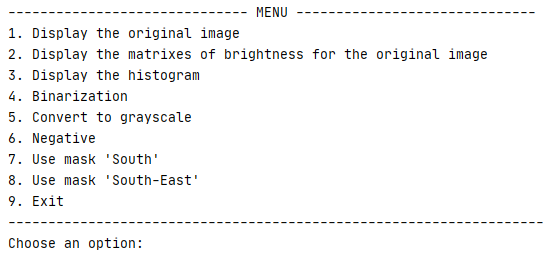

# Image Processing with Pyhton
This project is meant to perform following manipulations with image using Python without using special libraries:
* _Create the matrixes of brightness for the image_
* _Create the histograms of brightness_
* _Binarization_
* _Convert to grayscale_
* _Negative_
* _Use a kernel (filter)_

## Libraries
The only libraries used are NumPy and Matplotlib.

## Usage
Program can be used by following the instructions of console menu:
